# Feature Extractor MBO-LOB: Dataflow Visualization

> **Purpose**: Visual documentation of the feature-extractor library's dataflow and architecture using Mermaid diagrams.  
> **Version**: 2.0 (Enhanced Technical Details)

---

## 1. High-Level Pipeline Dataflow

---

## 2. Module Architecture

```mermaid
flowchart LR
    subgraph lib["lib.rs (Public API)"]
        prelude["prelude.rs<br/>━━━━━━━━━━━━<br/>Pipeline, PipelineBuilder<br/>FeatureExtractor<br/>SequenceBuilder, Sequence<br/>LabelGenerator, TrendLabel<br/>TensorFormatter<br/>All normalizers<br/>mbo-lob-reconstructor types"]
    end

    subgraph core["Core Modules"]
        builder["builder.rs<br/>━━━━━━━━━━━━<br/>PipelineBuilder<br/>.from_preset(Preset)<br/>.lob_levels(n)<br/>.with_derived_features()<br/>.with_mbo_features()<br/>.with_trading_signals()<br/>.window(size, stride)<br/>.volume_sampling(n)<br/>.build() → Pipeline"]
        config["config.rs<br/>━━━━━━━━━━━━<br/>PipelineConfig<br/>SamplingConfig<br/>SamplingStrategy enum<br/>AdaptiveSamplingConfig<br/>MultiScaleConfig<br/>ExperimentMetadata"]
        pipeline["pipeline.rs<br/>━━━━━━━━━━━━<br/>Pipeline struct<br/>process(path) → Output<br/>process_messages(iter)<br/>process_source(src)<br/>reset() state clear"]
        batch["batch.rs<br/>━━━━━━━━━━━━<br/>BatchProcessor<br/>BatchConfig<br/>BatchOutput<br/>DayResult<br/>CancellationToken<br/>ErrorMode enum<br/>Rayon thread pool"]
        validation["validation.rs<br/>━━━━━━━━━━━━<br/>FeatureValidator<br/>ValidationConfig<br/>ValidationResult<br/>crossed/locked quotes<br/>NaN/Inf detection"]
    end

    subgraph features["features/"]
        feat_mod["mod.rs<br/>━━━━━━━━━━━━<br/>FeatureConfig {<br/>  lob_levels: 10<br/>  tick_size: 0.01<br/>  include_derived<br/>  include_mbo<br/>  include_signals<br/>}<br/>feature_count() → usize<br/>FeatureExtractor"]
        lob["lob_features.rs<br/>━━━━━━━━━━━━<br/>extract_raw_features()<br/>extract_normalized_features()<br/>price: i64/1e9 → f64<br/>size: u32 → f64"]
        derived["derived_features.rs<br/>━━━━━━━━━━━━<br/>compute_derived_features()<br/>compute_depth_features()<br/>Returns [f64; 8]"]
        mbo["mbo_features.rs<br/>━━━━━━━━━━━━<br/>MboAggregator<br/>MboWindow (3 scales)<br/>OrderInfo tracker<br/>MboEvent conversion<br/>~8MB memory/symbol"]
        signals_mod["signals.rs<br/>━━━━━━━━━━━━<br/>OfiComputer<br/>  update(&amp;lob)<br/>  sample_and_reset()<br/>  is_warm() ≥100<br/>TimeRegime enum<br/>compute_signals()<br/>SIGNAL_COUNT = 14"]
        order_flow["order_flow.rs<br/>━━━━━━━━━━━━<br/>compute_ofi()<br/>compute_mlofi()<br/>QueueImbalance<br/>TradeFlowImbalance"]
        fi2010["fi2010.rs<br/>━━━━━━━━━━━━<br/>FI2010_FEATURE_COUNT=80<br/>Time-insensitive (20)<br/>Time-sensitive (20)<br/>Depth features (40)"]
        market_impact["market_impact.rs<br/>━━━━━━━━━━━━<br/>estimate_slippage()<br/>compute_vwap()<br/>MarketImpactEstimator"]
    end

    subgraph preprocessing["preprocessing/"]
        prep_mod["mod.rs<br/>━━━━━━━━━━━━<br/>Re-exports all"]
        sampling["sampling.rs<br/>━━━━━━━━━━━━<br/>EventBasedSampler<br/>VolumeBasedSampler<br/>should_sample() → bool<br/>reset()"]
        normalization["normalization.rs<br/>━━━━━━━━━━━━<br/>Normalizer trait<br/>ZScoreNormalizer<br/>RollingZScoreNormalizer<br/>GlobalZScoreNormalizer<br/>BilinearNormalizer<br/>PercentageChangeNormalizer<br/>MinMaxNormalizer<br/>PerFeatureNormalizer"]
        adaptive["adaptive_sampling.rs<br/>━━━━━━━━━━━━<br/>AdaptiveVolumeThreshold<br/>min_multiplier: 0.5<br/>max_multiplier: 2.0<br/>Uses VolatilityEstimator"]
        volatility["volatility.rs<br/>━━━━━━━━━━━━<br/>VolatilityEstimator<br/>Welford online algo<br/>O(1) update<br/>Numerically stable"]
    end

    subgraph sequence_builder["sequence_builder/"]
        seq_mod["mod.rs<br/>━━━━━━━━━━━━<br/>pub type FeatureVec =<br/>  Arc&lt;Vec&lt;f64&gt;&gt;<br/>8-byte clone vs 672B"]
        seq_builder["builder.rs<br/>━━━━━━━━━━━━<br/>SequenceBuilder<br/>SequenceConfig {<br/>  window_size: 100<br/>  stride: 10<br/>  max_buffer: 1000<br/>  feature_count<br/>}<br/>push_arc() zero-alloc<br/>try_build_sequence()"]
        horizon_aware["horizon_aware.rs<br/>━━━━━━━━━━━━<br/>HorizonAwareBuilder<br/>Label-aware windowing<br/>Ensures valid labels"]
        multiscale["multiscale.rs<br/>━━━━━━━━━━━━<br/>MultiScaleWindow<br/>Fast: 100 (~2s)<br/>Medium: 1000 (~20s)<br/>Slow: 5000 (~100s)<br/>push_arc() → all scales<br/>try_build_all()"]
    end

    subgraph labeling["labeling/"]
        label_mod["mod.rs<br/>━━━━━━━━━━━━<br/>LabelConfig {<br/>  horizon: usize<br/>  smoothing_window<br/>  threshold: f64<br/>}<br/>TrendLabel enum<br/>  Down=-1, Stable=0, Up=1<br/>LabelStats"]
        tlob["tlob.rs<br/>━━━━━━━━━━━━<br/>TlobLabelGenerator<br/>add_prices(&amp;[f64])<br/>generate_labels()<br/>compute_stats()<br/>Decoupled h/k params"]
        deeplob["deeplob.rs<br/>━━━━━━━━━━━━<br/>DeepLobLabelGenerator<br/>DeepLobMethod enum<br/>  VsCurrentPrice<br/>  VsPastAverage<br/>k = h (horizon bias)"]
        multi_horizon["multi_horizon.rs<br/>━━━━━━━━━━━━<br/>MultiHorizonLabelGenerator<br/>MultiHorizonConfig<br/>ThresholdStrategy {<br/>  Fixed(f64)<br/>  RollingSpread{...}<br/>  Quantile{...}<br/>}<br/>FI-2010/DeepLOB presets"]
    end

    subgraph schema["schema/"]
        schema_mod["mod.rs<br/>━━━━━━━━━━━━<br/>SCHEMA_VERSION<br/>get_feature_schema()"]
        feature_def["feature_def.rs<br/>━━━━━━━━━━━━<br/>FeatureDef struct<br/>FeatureCategory enum<br/>FeatureSchema<br/>Feature metadata"]
        presets["presets.rs<br/>━━━━━━━━━━━━<br/>Preset enum {<br/>  DeepLOB, TLOB<br/>  FI2010, TransLOB<br/>  LiT, Minimal, Full<br/>}"]
    end

    subgraph export["export/"]
        export_mod["mod.rs<br/>━━━━━━━━━━━━<br/>NumpyExporter<br/>BatchExporter<br/>Re-exports all"]
        tensor_format["tensor_format.rs<br/>━━━━━━━━━━━━<br/>TensorFormat enum {<br/>  Flat (T,F)<br/>  DeepLOB (T,4,L)<br/>  HLOB (T,L,4)<br/>  Image (T,C,H,W)<br/>}<br/>TensorFormatter<br/>FeatureMapping<br/>TensorOutput enum"]
        dataset_config["dataset_config.rs<br/>━━━━━━━━━━━━<br/>DatasetConfig<br/>SymbolConfig<br/>DataPathConfig<br/>DateRangeConfig<br/>FeatureSetConfig<br/>ExportSamplingConfig<br/>SplitConfig<br/>load_toml()/save_toml()"]
        export_aligned["export_aligned.rs<br/>━━━━━━━━━━━━<br/>AlignedBatchExporter<br/>align_sequences_with_labels()<br/>normalize_sequences()<br/>NormalizationStrategy<br/>NormalizationParams<br/>market_structure_zscore"]
    end

    lib --> core
    lib --> features
    lib --> preprocessing
    lib --> sequence_builder
    lib --> labeling
    lib --> schema
    lib --> export

    style lib fill:#bbdefb
    style core fill:#c8e6c9
    style features fill:#fff9c4
    style preprocessing fill:#ffccbc
    style sequence_builder fill:#d1c4e9
    style labeling fill:#f8bbd9
    style schema fill:#b2dfdb
    style export fill:#cfd8dc
```

---

## 3. Feature Extraction Pipeline Detail

```mermaid
flowchart TB
    subgraph input["Input State"]
        LobState["LobState (from mbo-lob-reconstructor)<br/>━━━━━━━━━━━━━━━━━━━━━━━━━━<br/>bid_prices: [i64; 20]  // fixed-point nanodollars<br/>bid_sizes: [u32; 20]   // shares<br/>ask_prices: [i64; 20]<br/>ask_sizes: [u32; 20]<br/>best_bid: Option i64<br/>best_ask: Option i64<br/>levels: usize (≤20)<br/>timestamp: Option i64  // nanoseconds<br/>sequence: u64"]
        MboMsg["MboMessage Stream<br/>━━━━━━━━━━━━━━━━━━━━━━━━━━<br/>order_id: u64<br/>action: Add|Modify|Cancel|Trade|Fill|Clear<br/>side: Bid|Ask|None<br/>price: i64 (nanodollars)<br/>size: u32 (shares)<br/>timestamp: Option i64"]
    end

    subgraph extractor["FeatureExtractor"]
        direction TB
        config["FeatureConfig<br/>━━━━━━━━━━━━━━━━━━━━━━━━━━<br/>lob_levels: usize = 10<br/>tick_size: f64 = 0.01<br/>include_derived: bool = false<br/>include_mbo: bool = false<br/>mbo_window_size: usize = 1000<br/>include_signals: bool = false<br/>━━━━━━━━━━━━━━━━━━━━━━━━━━<br/>DERIVED_FEATURE_COUNT = 8<br/>MBO_FEATURE_COUNT = 36<br/>SIGNAL_FEATURE_COUNT = 14"]
        
        extract_into["extract_into(&amp;lob, &amp;mut Vec f64)<br/>━━━━━━━━━━━━━━━━━━━━━━━━━━<br/>• Clears and reuses buffer<br/>• Zero heap allocations<br/>• Single-pass extraction"]
        extract_arc["extract_arc(&amp;lob) → Arc Vec f64<br/>━━━━━━━━━━━━━━━━━━━━━━━━━━<br/>• Calls extract_into internally<br/>• Wraps result in Arc<br/>• 8-byte clone cost"]
    end

    subgraph raw["Raw LOB Features (40)"]
        direction TB
        ask_prices["ask_prices [0-9]<br/>━━━━━━━━━━━━━━━━━━━━<br/>lob.ask_prices[i] / 1e9<br/>Convert i64 → f64 dollars<br/>0.0 if level empty"]
        ask_sizes["ask_sizes [10-19]<br/>━━━━━━━━━━━━━━━━━━━━<br/>lob.ask_sizes[i] as f64<br/>Raw share count"]
        bid_prices["bid_prices [20-29]<br/>━━━━━━━━━━━━━━━━━━━━<br/>lob.bid_prices[i] / 1e9<br/>Convert i64 → f64 dollars"]
        bid_sizes["bid_sizes [30-39]<br/>━━━━━━━━━━━━━━━━━━━━<br/>lob.bid_sizes[i] as f64<br/>Raw share count"]
    end

    subgraph derived["Derived Features (8)"]
        direction TB
        d0["[40] mid_price<br/>(best_bid + best_ask) / 2 / 1e9"]
        d1["[41] spread<br/>best_ask - best_bid / 1e9"]
        d2["[42] spread_bps<br/>spread / mid × 10000"]
        d3["[43] total_bid_volume<br/>Σ bid_sizes[0..L]"]
        d4["[44] total_ask_volume<br/>Σ ask_sizes[0..L]"]
        d5["[45] volume_imbalance<br/>(bid_v - ask_v) / (bid_v + ask_v)<br/>Range: [-1, 1]"]
        d6["[46] weighted_mid_price<br/>(bid×ask_v + ask×bid_v) / (bid_v + ask_v)"]
        d7["[47] price_impact<br/>|mid - weighted_mid|"]
    end

    subgraph mbo["MBO Features (36) via MboAggregator"]
        direction TB
        subgraph mbo_windows["Multi-Timescale Windows"]
            fast_w["Fast Window: 100 events (~2s)"]
            med_w["Medium Window: 1000 events (~20s)<br/>PRIMARY extraction source"]
            slow_w["Slow Window: 5000 events (~100s)"]
        end
        subgraph mbo_flow["Order Flow [48-59] (12)"]
            of1["add_rate_bid/ask<br/>cancel_rate_bid/ask<br/>trade_rate_bid/ask"]
            of2["net_order_flow<br/>net_cancel_flow<br/>net_trade_flow<br/>aggressive_order_ratio<br/>order_flow_volatility<br/>flow_regime_indicator"]
        end
        subgraph mbo_size["Size Distribution [60-67] (8)"]
            sz["size_p25/p50/p75/p90<br/>size_zscore<br/>large_order_ratio<br/>size_skewness<br/>size_concentration"]
        end
        subgraph mbo_queue["Queue &amp; Depth [68-73] (6)"]
            q["avg_queue_position<br/>queue_size_ahead<br/>orders_per_level<br/>level_concentration<br/>depth_ticks_bid/ask"]
        end
        subgraph mbo_inst["Institutional [74-77] (4)"]
            inst["large_order_frequency<br/>large_order_imbalance<br/>modification_score<br/>iceberg_proxy"]
        end
        subgraph mbo_core["Core MBO [78-83] (6)"]
            core["avg_order_age<br/>median_order_lifetime<br/>avg_fill_ratio<br/>avg_time_to_first_fill<br/>cancel_to_add_ratio<br/>active_order_count"]
        end
    end

    subgraph signals["Trading Signals (14) via OfiComputer"]
        direction TB
        subgraph ofi_comp["OfiComputer State"]
            ofi_state["prev_best_bid/ask: Option i64<br/>prev_best_bid/ask_size: u32<br/>ofi_bid/ofi_ask: i64 accumulators<br/>depth_sum/count: u64<br/>state_changes_since_reset: u64<br/>MIN_WARMUP = 100"]
        end
        subgraph sig_dir["Direction [84-86]"]
            s84["[84] true_ofi: Σ(bid_Δ - ask_Δ)<br/>Cont et al. 2014"]
            s85["[85] depth_norm_ofi: ofi/avg_depth"]
            s86["[86] executed_pressure:<br/>trade_rate_ask - trade_rate_bid"]
        end
        subgraph sig_timing["Timing [87, 93]"]
            s87["[87] signed_mp_delta_bps:<br/>(microprice - mid) / mid × 10000<br/>Stoikov 2018"]
            s93["[93] time_regime: 0-4<br/>Open|Early|Midday|Close|Closed<br/>UTC→ET with DST handling"]
        end
        subgraph sig_confirm["Confirmation [88-89]"]
            s88["[88] trade_asymmetry:<br/>(buys - sells) / total"]
            s89["[89] cancel_asymmetry:<br/>(cancel_ask - cancel_bid) / total"]
        end
        subgraph sig_impact["Impact [90-91]"]
            s90["[90] fragility_score: [0,∞)<br/>level_conc / ln(avg_depth)"]
            s91["[91] depth_asymmetry:<br/>(depth_ticks_bid - depth_ticks_ask) / total"]
        end
        subgraph sig_safety["Safety Gates [92, 94]"]
            s92["[92] book_valid: {0,1}<br/>bid>0 &amp;&amp; ask>0 &amp;&amp; bid&lt;ask"]
            s94["[94] mbo_ready: {0,1}<br/>state_changes ≥ 100"]
        end
        subgraph sig_meta["Meta [95-97]"]
            s95["[95] dt_seconds: f64<br/>Time since last sample"]
            s96["[96] invalidity_delta: f64<br/>Quote anomaly count"]
            s97["[97] schema_version: 2.1"]
        end
    end

    subgraph output["Output Buffer"]
        buffer["Vec&lt;f64&gt; output<br/>━━━━━━━━━━━━━━━━━━━━━━━━━━<br/>40 features: Raw LOB only<br/>48 features: + Derived<br/>76 features: + MBO<br/>84 features: + Derived + MBO<br/>98 features: + All (Signals)<br/>━━━━━━━━━━━━━━━━━━━━━━━━━━<br/>Layout: GROUPED<br/>[ask_p, ask_v, bid_p, bid_v, derived, mbo, signals]"]
        arc_vec["Arc&lt;Vec&lt;f64&gt;&gt; (FeatureVec)<br/>━━━━━━━━━━━━━━━━━━━━━━━━━━<br/>Clone cost: 8 bytes (vs 672B)<br/>Shared across:<br/>• Overlapping sequences<br/>• Multi-scale windows<br/>• Parallel threads"]
    end

    LobState --> extract_into
    MboMsg -->|"process_event()"| mbo_windows
    config --> extract_into

    extract_into --> raw
    extract_into --> derived
    extract_into --> mbo
    extract_into --> signals

    raw --> buffer
    derived --> buffer
    mbo --> buffer
    signals --> buffer

    buffer --> arc_vec
    extract_arc --> arc_vec

    style extractor fill:#e3f2fd
    style raw fill:#c8e6c9
    style derived fill:#fff9c4
    style mbo fill:#ffccbc
    style signals fill:#f8bbd9
    style output fill:#e1f5fe
```

---

## 4. Sequence Building & Windowing

```mermaid
flowchart TB
    subgraph input["Feature Input"]
        features["Arc&lt;Vec&lt;f64&gt;&gt; (FeatureVec)<br/>━━━━━━━━━━━━━━━━━━━━━━━━━━<br/>40-98 f64 values<br/>Wrapped in Arc for zero-copy"]
        timestamp["Timestamp: u64<br/>━━━━━━━━━━━━━━━━━━━━━━━━━━<br/>Nanoseconds since epoch<br/>From LobState.timestamp"]
    end

    subgraph seq_config["SequenceConfig"]
        cfg_detail["window_size: usize = 100<br/>━━━━━━━━━━━━━━━━━━━━━━━━━━<br/>Snapshots per sequence<br/>TLOB paper default"]
        stride_detail["stride: usize = 10<br/>━━━━━━━━━━━━━━━━━━━━━━━━━━<br/>Skip between sequences<br/>90% overlap with stride=10"]
        max_buf_detail["max_buffer_size: usize = 1000<br/>━━━━━━━━━━━━━━━━━━━━━━━━━━<br/>Circular buffer capacity<br/>Prevents unbounded growth"]
        feat_count_detail["feature_count: usize<br/>━━━━━━━━━━━━━━━━━━━━━━━━━━<br/>MUST match FeatureConfig<br/>Auto-synced by PipelineConfig"]
    end

    subgraph builder["SequenceBuilder Internal State"]
        direction TB
        circular["buffer: VecDeque&lt;Snapshot&gt;<br/>━━━━━━━━━━━━━━━━━━━━━━━━━━<br/>Snapshot {<br/>  features: FeatureVec (Arc)<br/>  timestamp: u64<br/>}<br/>━━━━━━━━━━━━━━━━━━━━━━━━━━<br/>O(1) push_back/pop_front"]
        counters["Counters<br/>━━━━━━━━━━━━━━━━━━━━━━━━━━<br/>total_pushed: u64<br/>total_sequences: u64<br/>last_sequence_pos: usize"]
        push_arc["push_arc(ts, features)<br/>━━━━━━━━━━━━━━━━━━━━━━━━━━<br/>1. Create Snapshot<br/>2. Push to buffer<br/>3. Evict if > max_buffer<br/>4. Increment counters"]
        try_build["try_build_sequence()<br/>━━━━━━━━━━━━━━━━━━━━━━━━━━<br/>Called after each push<br/>Returns Option Sequence<br/>STREAMING mode"]
    end

    subgraph streaming["Streaming Sequence Generation Logic"]
        direction TB
        check["Check: buffer.len() >= window_size?<br/>━━━━━━━━━━━━━━━━━━━━━━━━━━<br/>Need 100 snapshots minimum"]
        stride_check["Check: (total_pushed - last_pos) >= stride?<br/>━━━━━━━━━━━━━━━━━━━━━━━━━━<br/>Enforce stride=10 spacing"]
        build["Build Sequence<br/>━━━━━━━━━━━━━━━━━━━━━━━━━━<br/>1. Slice last window_size items<br/>2. Clone Arc refs (cheap)<br/>3. Calculate timestamps<br/>4. Update last_sequence_pos"]
        accumulate["Accumulated Sequences<br/>━━━━━━━━━━━━━━━━━━━━━━━━━━<br/>PipelineOutput.sequences<br/>No data loss from eviction<br/>100% sequence efficiency"]
    end

    subgraph multiscale["MultiScaleWindow (Optional)"]
        direction TB
        ms_config["MultiScaleConfig<br/>━━━━━━━━━━━━━━━━━━━━━━━━━━<br/>fast_window: 100<br/>medium_window: 1000<br/>slow_window: 5000"]
        fast["fast_builder: SequenceBuilder<br/>━━━━━━━━━━━━━━━━━━━━━━━━━━<br/>~2 seconds of data<br/>High-frequency patterns"]
        medium["medium_builder: SequenceBuilder<br/>━━━━━━━━━━━━━━━━━━━━━━━━━━<br/>~20 seconds of data<br/>Medium-term trends"]
        slow["slow_builder: SequenceBuilder<br/>━━━━━━━━━━━━━━━━━━━━━━━━━━<br/>~100 seconds of data<br/>Long-term context"]
        ms_push["push_arc(ts, features)<br/>━━━━━━━━━━━━━━━━━━━━━━━━━━<br/>Same Arc pushed to ALL scales<br/>Zero additional allocation<br/>Memory: 16 bytes (2 Arc clones)"]
    end

    subgraph output["Sequence Output Structures"]
        sequence["Sequence {<br/>━━━━━━━━━━━━━━━━━━━━━━━━━━<br/>  features: Vec&lt;FeatureVec&gt;<br/>    // [window_size] Arc refs<br/>  start_timestamp: u64<br/>  end_timestamp: u64<br/>  duration_ns: u64<br/>  length: usize  // == window_size<br/>}<br/>━━━━━━━━━━━━━━━━━━━━━━━━━━<br/>Memory: ~848 bytes (40 feat)<br/>100 × 8-byte Arc ptrs + metadata"]
        multi_seq["MultiScaleSequence {<br/>━━━━━━━━━━━━━━━━━━━━━━━━━━<br/>  fast: Option&lt;Sequence&gt;<br/>  medium: Option&lt;Sequence&gt;<br/>  slow: Option&lt;Sequence&gt;<br/>}<br/>━━━━━━━━━━━━━━━━━━━━━━━━━━<br/>3 temporal resolutions<br/>Concatenate for transformer"]
    end

    features --> push_arc
    timestamp --> push_arc
    seq_config --> builder

    push_arc --> circular
    circular --> counters
    counters --> try_build
    try_build --> check
    check -->|"Yes"| stride_check
    check -->|"No"| input
    stride_check -->|"Yes"| build
    stride_check -->|"No"| input
    build --> sequence
    build --> accumulate

    features --> ms_push
    ms_push --> fast
    ms_push --> medium
    ms_push --> slow
    fast --> multi_seq
    medium --> multi_seq
    slow --> multi_seq

    style builder fill:#e8f5e9
    style streaming fill:#fff3e0
    style multiscale fill:#f3e5f5
    style output fill:#e1f5fe
```

---

## 5. Sampling Strategies

```mermaid
flowchart TB
    subgraph trigger["Sampling Trigger Inputs"]
        msg["MboMessage<br/>━━━━━━━━━━━━━━━━━━━━━━━━━━<br/>Each valid MBO event<br/>Filtered: order_id != 0<br/>           size != 0<br/>           price > 0"]
        vol["Event Volume: msg.size<br/>━━━━━━━━━━━━━━━━━━━━━━━━━━<br/>u32 shares traded<br/>Accumulated for volume sampling"]
        ts["Timestamp: msg.timestamp<br/>━━━━━━━━━━━━━━━━━━━━━━━━━━<br/>u64 nanoseconds<br/>For minimum interval check"]
    end

    subgraph event["EventBasedSampler"]
        event_state["State<br/>━━━━━━━━━━━━━━━━━━━━━━━━━━<br/>sample_interval: u64 = 1000<br/>event_count: u64 = 0<br/>sample_count: u64 = 0"]
        event_logic["should_sample() Logic<br/>━━━━━━━━━━━━━━━━━━━━━━━━━━<br/>1. event_count += 1<br/>2. if count >= interval:<br/>     count = 0<br/>     sample_count += 1<br/>     return true<br/>3. return false"]
        event_check{"event_count >= sample_interval?"}
        event_sample["Sample &amp; Reset<br/>━━━━━━━━━━━━━━━━━━━━━━━━━━<br/>event_count = 0<br/>return true"]
        event_char["Characteristics<br/>━━━━━━━━━━━━━━━━━━━━━━━━━━<br/>✓ Simple, deterministic<br/>✓ Predictable sample count<br/>✗ No market adaptation<br/>✗ Over-samples in quiet periods"]
    end

    subgraph volume["VolumeBasedSampler"]
        vol_state["State<br/>━━━━━━━━━━━━━━━━━━━━━━━━━━<br/>target_volume: u64 = 1000<br/>min_time_interval_ns: u64 = 1_000_000<br/>accumulated_volume: u64 = 0<br/>last_sample_time: u64 = 0"]
        vol_logic["should_sample(size, ts) Logic<br/>━━━━━━━━━━━━━━━━━━━━━━━━━━<br/>1. accumulated += size<br/>2. elapsed = ts - last_sample_time<br/>3. if vol >= target AND<br/>      elapsed >= min_interval:<br/>     accumulated = 0<br/>     last_sample_time = ts<br/>     return true<br/>4. return false"]
        vol_check{"volume >= target<br/>AND<br/>time >= min_interval?"}
        vol_sample["Sample &amp; Reset<br/>━━━━━━━━━━━━━━━━━━━━━━━━━━<br/>accumulated = 0<br/>last_sample_time = ts<br/>return true"]
        vol_char["Characteristics<br/>━━━━━━━━━━━━━━━━━━━━━━━━━━<br/>✓ Adapts to market activity<br/>✓ TLOB paper recommended<br/>✓ Better signal quality<br/>✓ Captures institutional flow<br/>✗ Variable samples/day"]
    end

    subgraph adaptive["AdaptiveVolumeThreshold"]
        adapt_state["State<br/>━━━━━━━━━━━━━━━━━━━━━━━━━━<br/>base_threshold: u64<br/>min_multiplier: f64 = 0.5<br/>max_multiplier: f64 = 2.0<br/>volatility_estimator: VolatilityEstimator"]
        volatility["VolatilityEstimator<br/>━━━━━━━━━━━━━━━━━━━━━━━━━━<br/>Welford online algorithm<br/>O(1) per update<br/>Numerically stable<br/>No overflow risk"]
        adjust["Threshold Adjustment<br/>━━━━━━━━━━━━━━━━━━━━━━━━━━<br/>Low volatility → 0.5× threshold<br/>  (more samples in quiet market)<br/>High volatility → 2.0× threshold<br/>  (fewer samples in chaos)<br/>Smooth transition via sigmoid"]
        adapt_output["current_threshold()<br/>━━━━━━━━━━━━━━━━━━━━━━━━━━<br/>base × multiplier<br/>Dynamically adjusted"]
    end

    subgraph output["Sample Decision"]
        should_sample["should_sample() → bool<br/>━━━━━━━━━━━━━━━━━━━━━━━━━━<br/>Pipeline calls on each message<br/>Triggers feature extraction"]
        extract["Trigger Feature Extraction<br/>━━━━━━━━━━━━━━━━━━━━━━━━━━<br/>extractor.extract_into()<br/>Capture current LobState<br/>Record mid_price for labels"]
        stats["Typical Statistics<br/>━━━━━━━━━━━━━━━━━━━━━━━━━━<br/>Event (1000): ~10K-18K samples/day<br/>Volume (1000): ~5K-25K samples/day<br/>Adaptive: varies with volatility"]
    end

    msg --> event_logic
    msg --> vol_logic
    vol --> vol_logic
    ts --> vol_logic

    event_logic --> event_check
    event_check -->|"Yes"| event_sample
    event_check -->|"No"| trigger
    event_sample --> should_sample

    vol_logic --> vol_check
    vol_check -->|"Yes"| vol_sample
    vol_check -->|"No"| trigger
    vol_sample --> should_sample

    volatility --> adjust
    adjust --> adapt_output
    adapt_output -.->|"modifies"| vol_state

    should_sample -->|"true"| extract

    style event fill:#c8e6c9
    style volume fill:#fff9c4
    style adaptive fill:#ffccbc
    style output fill:#e1f5fe
```

---

## 6. Label Generation Flow

---

## 7. Export Pipeline

---

## 8. Parallel Batch Processing

```mermaid
flowchart TB
    subgraph config["Configuration Layer"]
        pipeline_config["PipelineConfig (Arc-wrapped)<br/>━━━━━━━━━━━━━━━━━━━━━━━━━━<br/>features: FeatureConfig<br/>sequence: SequenceConfig<br/>sampling: SamplingConfig<br/>━━━━━━━━━━━━━━━━━━━━━━━━━━<br/>Cloned to each thread<br/>Immutable shared state"]
        batch_config["BatchConfig<br/>━━━━━━━━━━━━━━━━━━━━━━━━━━<br/>num_threads: Option usize<br/>  None = Rayon default (num_cpus)<br/>error_mode: ErrorMode<br/>report_progress: bool<br/>stack_size: Option usize<br/>hot_store_dir: Option PathBuf"]
        error_mode["ErrorMode Enum<br/>━━━━━━━━━━━━━━━━━━━━━━━━━━<br/>FailFast<br/>  Stop on first error<br/>  Fast feedback<br/>CollectErrors<br/>  Continue processing<br/>  Aggregate all errors"]
        cancel_token["CancellationToken<br/>━━━━━━━━━━━━━━━━━━━━━━━━━━<br/>cancelled: Arc AtomicBool<br/>━━━━━━━━━━━━━━━━━━━━━━━━━━<br/>new() → Token<br/>cancel() → set true<br/>is_cancelled() → bool<br/>reset() → for reuse<br/>━━━━━━━━━━━━━━━━━━━━━━━━━━<br/>Thread-safe, cheap clone"]
    end

    subgraph processor["BatchProcessor"]
        create["BatchProcessor::new(pipeline_cfg, batch_cfg)<br/>━━━━━━━━━━━━━━━━━━━━━━━━━━<br/>Auto-creates HotStoreManager<br/>if hot_store_dir is set"]
        builders["Builder Methods<br/>━━━━━━━━━━━━━━━━━━━━━━━━━━<br/>.with_cancellation_token(token)<br/>.with_progress_callback(cb)<br/>.with_hot_store(manager)"]
        process["process_files(&amp;[paths]) → Result BatchOutput<br/>━━━━━━━━━━━━━━━━━━━━━━━━━━<br/>Creates local Rayon thread pool<br/>Parallel iteration over files<br/>Each thread: own Pipeline instance"]
        cancel_methods["Cancellation Methods<br/>━━━━━━━━━━━━━━━━━━━━━━━━━━<br/>cancel() → signal stop<br/>is_cancelled() → check<br/>cancellation_token() → clone"]
    end

    subgraph threadpool["Rayon Thread Pool (Local)"]
        pool_config["ThreadPoolBuilder<br/>━━━━━━━━━━━━━━━━━━━━━━━━━━<br/>num_threads: batch_config.num_threads<br/>stack_size: batch_config.stack_size<br/>━━━━━━━━━━━━━━━━━━━━━━━━━━<br/>Local pool (not global)<br/>Correct parallel execution"]
        thread1["Thread 1<br/>━━━━━━━━━━━━━━━━━━━━━━━━━━<br/>Pipeline::from_config(cfg.clone())<br/>pipeline.process(file1)<br/>No shared mutable state"]
        thread2["Thread 2<br/>━━━━━━━━━━━━━━━━━━━━━━━━━━<br/>Pipeline::from_config(cfg.clone())<br/>pipeline.process(file2)<br/>Independent execution"]
        thread3["Thread 3<br/>━━━━━━━━━━━━━━━━━━━━━━━━━━<br/>Pipeline::from_config(cfg.clone())<br/>pipeline.process(file3)<br/>Bit-identical to sequential"]
        threadN["Thread N<br/>━━━━━━━━━━━━━━━━━━━━━━━━━━<br/>Pipeline::from_config(cfg.clone())<br/>pipeline.process(fileN)<br/>No mutex contention"]
    end

    subgraph files["Input Files (par_iter)"]
        file1["day1.dbn.zst<br/>~7M messages"]
        file2["day2.dbn.zst<br/>~7M messages"]
        file3["day3.dbn.zst<br/>~7M messages"]
        fileN["dayN.dbn.zst<br/>~7M messages"]
    end

    subgraph hot_store["HotStoreManager (Optional)"]
        hs_manager["HotStoreManager<br/>━━━━━━━━━━━━━━━━━━━━━━━━━━<br/>hot_store_dir: PathBuf<br/>━━━━━━━━━━━━━━━━━━━━━━━━━━<br/>get_or_decompress(path)<br/>  → decompressed path<br/>~30% faster reads"]
        hs_files["Decompressed Cache<br/>━━━━━━━━━━━━━━━━━━━━━━━━━━<br/>.dbn files (no zstd)<br/>Reused across runs<br/>Managed lifecycle"]
    end

    subgraph results["Result Aggregation"]
        day_result["DayResult (per file)<br/>━━━━━━━━━━━━━━━━━━━━━━━━━━<br/>day: String (filename stem)<br/>file_path: String<br/>output: PipelineOutput<br/>elapsed: Duration<br/>thread_id: usize"]
        batch_output["BatchOutput (aggregated)<br/>━━━━━━━━━━━━━━━━━━━━━━━━━━<br/>results: Vec DayResult<br/>errors: Vec FileError<br/>elapsed: Duration (total)<br/>threads_used: usize<br/>was_cancelled: bool<br/>skipped_count: usize<br/>━━━━━━━━━━━━━━━━━━━━━━━━━━<br/>successful_count() → usize<br/>failed_count() → usize<br/>throughput_msg_per_sec() → f64"]
    end

    subgraph cancellation["Cancellation Flow"]
        check_cancel{"Check: is_cancelled()?<br/>━━━━━━━━━━━━━━━━━━━━━━━━━━<br/>Before each file<br/>O(1) atomic read"}
        skip["Skip Remaining Files<br/>━━━━━━━━━━━━━━━━━━━━━━━━━━<br/>skipped_count += remaining<br/>was_cancelled = true"]
        continue_proc["Continue Processing<br/>━━━━━━━━━━━━━━━━━━━━━━━━━━<br/>Process current file<br/>Collect DayResult"]
        external_cancel["External Cancellation<br/>━━━━━━━━━━━━━━━━━━━━━━━━━━<br/>From another thread:<br/>  token.cancel()<br/>━━━━━━━━━━━━━━━━━━━━━━━━━━<br/>Use case: timeout<br/>Use case: user interrupt"]
    end

    subgraph performance["Performance Characteristics"]
        perf_notes["Throughput Notes<br/>━━━━━━━━━━━━━━━━━━━━━━━━━━<br/>Sequential: ~42K msg/sec<br/>2 threads: ~64K msg/sec<br/>━━━━━━━━━━━━━━━━━━━━━━━━━━<br/>Bottleneck: zstd decompress<br/>  (single-threaded per stream)<br/>Sub-linear scaling >2-4 threads<br/>I/O saturation limit"]
    end

    pipeline_config --> create
    batch_config --> create
    error_mode --> batch_config
    create --> builders
    cancel_token --> builders
    builders --> process

    process --> pool_config
    pool_config --> thread1
    pool_config --> thread2
    pool_config --> thread3
    pool_config --> threadN

    file1 --> thread1
    file2 --> thread2
    file3 --> thread3
    fileN --> threadN

    hot_store -.-> thread1
    hot_store -.-> thread2
    hot_store -.-> thread3
    hot_store -.-> threadN

    thread1 --> day_result
    thread2 --> day_result
    thread3 --> day_result
    threadN --> day_result

    day_result --> batch_output

    cancel_token --> check_cancel
    external_cancel --> cancel_token
    check_cancel -->|"Yes"| skip
    check_cancel -->|"No"| continue_proc
    skip --> batch_output
    continue_proc --> day_result

    style processor fill:#e8f5e9
    style threadpool fill:#fff9c4
    style cancellation fill:#ffccbc
    style results fill:#e1f5fe
    style hot_store fill:#f3e5f5
```

---

## 9. Complete Data Flow Summary

---

## 10. Feature Index Reference

```mermaid
graph LR
    subgraph raw["Raw LOB (40 features)"]
        direction TB
        R1["[0-9] ask_prices<br/>━━━━━━━━━━━━━━━━<br/>i64/1e9 → f64 dollars<br/>Best ask at index 0"]
        R2["[10-19] ask_sizes<br/>━━━━━━━━━━━━━━━━<br/>u32 → f64 shares<br/>Volume at each level"]
        R3["[20-29] bid_prices<br/>━━━━━━━━━━━━━━━━<br/>i64/1e9 → f64 dollars<br/>Best bid at index 0"]
        R4["[30-39] bid_sizes<br/>━━━━━━━━━━━━━━━━<br/>u32 → f64 shares<br/>Volume at each level"]
    end

    subgraph derived["Derived (8 features)"]
        direction TB
        D1["[40] mid_price<br/>(bid+ask)/2"]
        D2["[41] spread<br/>ask-bid dollars"]
        D3["[42] spread_bps<br/>spread/mid×10000"]
        D4["[43] total_bid_vol<br/>Σ bid_sizes"]
        D5["[44] total_ask_vol<br/>Σ ask_sizes"]
        D6["[45] vol_imbalance<br/>[-1,1] normalized"]
        D7["[46] weighted_mid<br/>microprice"]
        D8["[47] price_impact<br/>|mid-microprice|"]
    end

    subgraph mbo["MBO (36 features)"]
        direction TB
        M1["[48-59] Order Flow<br/>━━━━━━━━━━━━━━━━<br/>add/cancel/trade rates<br/>net flows, volatility"]
        M2["[60-67] Size Dist<br/>━━━━━━━━━━━━━━━━<br/>p25/p50/p75/p90<br/>zscore, skewness"]
        M3["[68-73] Queue<br/>━━━━━━━━━━━━━━━━<br/>position, depth<br/>concentration"]
        M4["[74-77] Institutional<br/>━━━━━━━━━━━━━━━━<br/>large orders<br/>iceberg proxy"]
        M5["[78-83] Core MBO<br/>━━━━━━━━━━━━━━━━<br/>order age, fill ratio<br/>cancel/add ratio"]
    end

    subgraph signals["Signals (14 features)"]
        direction TB
        S1["[84-86] Direction<br/>━━━━━━━━━━━━━━━━<br/>true_ofi (Cont 2014)<br/>depth_norm_ofi<br/>executed_pressure"]
        S2["[87] Timing<br/>━━━━━━━━━━━━━━━━<br/>signed_mp_delta_bps<br/>(Stoikov 2018)"]
        S3["[88-89] Confirm<br/>━━━━━━━━━━━━━━━━<br/>trade_asymmetry<br/>cancel_asymmetry"]
        S4["[90-91] Impact<br/>━━━━━━━━━━━━━━━━<br/>fragility_score<br/>depth_asymmetry"]
        S5["[92-94] Safety<br/>━━━━━━━━━━━━━━━━<br/>book_valid {0,1}<br/>time_regime {0-4}<br/>mbo_ready {0,1}"]
        S6["[95-97] Meta<br/>━━━━━━━━━━━━━━━━<br/>dt_seconds<br/>invalidity_delta<br/>schema_version=2.1"]
    end

    raw --> derived --> mbo --> signals

    style raw fill:#c8e6c9
    style derived fill:#fff9c4
    style mbo fill:#ffccbc
    style signals fill:#f8bbd9
```

---

## 11. Memory & Performance Characteristics

```mermaid
flowchart TB
    subgraph memory["Memory Budget"]
        lob_mem["LobState<br/>━━━━━━━━━━━━━━━━<br/>~560 bytes (stack)<br/>[i64;20]×2 = 320B<br/>[u32;20]×2 = 160B<br/>+ metadata"]
        feat_mem["Feature Vector<br/>━━━━━━━━━━━━━━━━<br/>40 feat: 320 bytes<br/>84 feat: 672 bytes<br/>98 feat: 784 bytes"]
        arc_mem["Arc Overhead<br/>━━━━━━━━━━━━━━━━<br/>8 bytes per clone<br/>vs 672B Vec clone<br/>99.99% savings"]
        seq_mem["Sequence (40 feat)<br/>━━━━━━━━━━━━━━━━<br/>~848 bytes<br/>100 × 8B Arc ptrs<br/>+ timestamps"]
        mbo_mem["MboAggregator<br/>━━━━━━━━━━━━━━━━<br/>~8 MB per symbol<br/>3 windows<br/>Order tracker"]
        buffer_mem["Sequence Buffer<br/>━━━━━━━━━━━━━━━━<br/>1000 × 848B<br/>~848 KB max"]
    end

    subgraph performance["Performance Targets"]
        hot_paths["Hot Path Operations<br/>━━━━━━━━━━━━━━━━<br/>should_sample(): ~2-3 cycles<br/>extract_raw_features(): ~50 ns<br/>push_arc(): O(1) amortized<br/>try_build_sequence(): O(window)"]
        throughput["Throughput<br/>━━━━━━━━━━━━━━━━<br/>Sequential: ~42K msg/sec<br/>Parallel 2T: ~64K msg/sec<br/>Bottleneck: zstd decompress"]
        zero_alloc["Zero-Allocation APIs<br/>━━━━━━━━━━━━━━━━<br/>extract_into(): buffer reuse<br/>push_arc(): Arc clone only<br/>No allocations in hot path"]
    end

    subgraph optimizations["Key Optimizations"]
        welford["Welford's Algorithm<br/>━━━━━━━━━━━━━━━━<br/>Online mean/variance<br/>O(1) per update<br/>Numerically stable"]
        cache["PriceLevel O(1) Cache<br/>━━━━━━━━━━━━━━━━<br/>In mbo-lob-reconstructor<br/>Eliminates O(n) sum<br/>Per-level volume cached"]
        streaming["Streaming Sequences<br/>━━━━━━━━━━━━━━━━<br/>Build during processing<br/>No buffer eviction loss<br/>100% data utilization"]
    end

    style memory fill:#e8f5e9
    style performance fill:#fff9c4
    style optimizations fill:#e1f5fe
```

---

## Legend

| Symbol | Meaning |
|--------|---------|
| 📁 | Input/Output files |
| 🔗 | External dependency |
| ⚙️ | Core processing |
| 📊 | Data sampling |
| 🧮 | Feature computation |
| 📦 | Data packaging |
| 🏷️ | Label generation |
| 💾 | Data export |
| 📤 | Final output |

---

## Quick Reference Tables

### Feature Count Configurations

| Configuration | Count | Indices |
|--------------|-------|---------|
| Raw LOB only | 40 | 0-39 |
| + Derived | 48 | 0-47 |
| + MBO | 76 | 0-39, 48-83 |
| + Derived + MBO | 84 | 0-83 |
| + All (Signals) | 98 | 0-97 |

### Key Defaults

| Parameter | Default | Notes |
|-----------|---------|-------|
| LOB levels | 10 | Standard for research |
| Window size | 100 | TLOB paper |
| Stride | 10 | 90% overlap |
| Volume threshold | 1000 | Shares per sample |
| Min time interval | 1 ms | Prevents over-sampling |
| Label horizon | 50 | Steps ahead |
| Label threshold | 0.0008 | 8 basis points |

### Data Types Summary

| Stage | Type | Size |
|-------|------|------|
| DBN message | `dbn::MboMsg` | ~120 bytes |
| Internal message | `MboMessage` | 32 bytes |
| LOB state | `LobState` | ~560 bytes |
| Feature vector (98) | `Arc<Vec<f64>>` | 8 + 784 bytes |
| Sequence (100×98) | `Sequence` | ~848 bytes |

---

*Generated from codebase analysis on 2025-12-21 | Version 2.0 (Enhanced Technical Details)*
